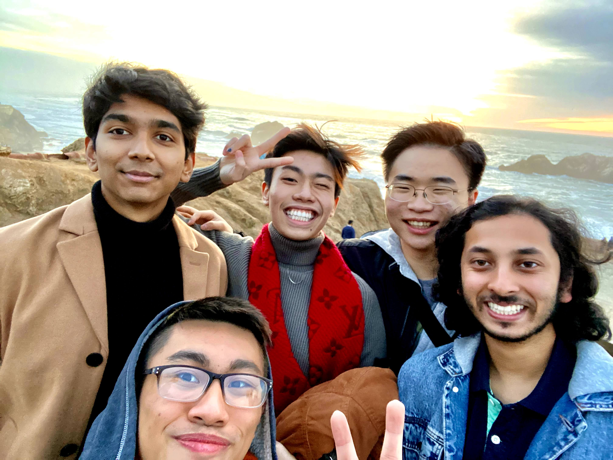

# Adrian Liu's Page
 
> I'm the one in the top middle
```
Taken 12/18/2020
Location: San Francisco, Land's End
```
## About Me
Hello! I'm **Adrian Liu** and I'm currently a second year `Math-CS` major at UCSD. These are some hobbies that I love (in no particular order):
- Baking
- Hiking
- Cooking
- Singing (playing the guitar/piano)
- Gaming 

These are some of the languages that I like to program in and in order of proficiency:

1. C++
2. Java
3. Python
4. Javascript
5. HTML/CSS

Here are a few things that I'd love to do once the quarantine is lifted:
- [ ] Go on a roadtrip with friends
- [ ] Catch up with SD friends
- [ ] Vacataion with my family/friends


Here is a relative link to my Readme [ReadMe](README.md)

This site was built using [GitHub Pages](https://pages.github.com/)